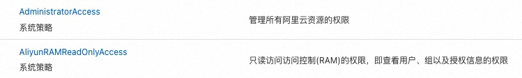

# demo-alicloud-ack-terraform

## 前置条件

* [Terraform](https://developer.hashicorp.com/terraform/install)已安装。
* [kubectl](https://kubernetes.io/releases/download/)已安装。
* 已在[官网](https://www.aliyun.com/)注册一个阿里云账号。

## 操作步骤

:bell: **注意事项：** 不要手工修改`*.tfstate.*`文件，它们是由Terraform自动管理的.

### 1. 完成本地环境配置

- [创建](https://help.aliyun.com/zh/ram/user-guide/create-a-ram-user)一个RAM用户，并赋予OpenAPI调用访问的权限。
记下`AccessKey ID`与`AccessKey Secret`。

- 为新建的RAM用户[授权](https://help.aliyun.com/zh/ram/user-guide/grant-permissions-to-the-ram-user)。如果为了方便测试的话，可以先赋如下权限：



如果后续命令执行失败，并且报错信息中提示缺少某些特定角色的权限，请参考这份[文档](https://help.aliyun.com/zh/ram/product-overview/services-that-work-with-ram)，添加相应权限。

有可能需要创建如下角色才能完成后续集群创建：[AliyunOOSLifecycleHook4CSRole](https://ram.console.aliyun.com/role/authorize?spm=a2c4g.11186623.0.0.6f6d22fdC94193&request=%7B%22ReturnUrl%22%3A%22https%3A%2F%2Fram.console.aliyun.com%22%2C%22Services%22%3A%5B%7B%22Roles%22%3A%5B%7B%22RoleName%22%3A%22AliyunOOSLifecycleHook4CSRole%22%2C%22TemplateId%22%3A%22AliyunOOSLifecycleHook4CSRole%22%7D%5D%2C%22Service%22%3A%22OOS%22%7D%5D%7D)

接下来配置本地环境变量：

Shell：

```shell
export ALICLOUD_ACCESS_KEY="<ACCESS_KEY>"
export ALICLOUD_SECRET_KEY="<ACCESS_KEY_SECRET>"

# check it
printenv | grep '^ALICLOUD_*'
```

PowerShell:

```powershell
$Env:ALICLOUD_ACCESS_KEY = "<ACCESS_KEY>"
$Env:ALICLOUD_SECRET_KEY = "<ACCESS_KEY_SECRET>"

# check it
gci env:ALICLOUD_*
```

**可选步骤：** 为Terraform[配置](https://help.aliyun.com/document_detail/2584222.html)阿里镜像，加快后续Terraform执行速度。

### 2. 运行Terraform创建ACK集群

如果之前从未开通过ACK服务，那么先进入`alicloud-ack-enabler`文件夹，运行如下命令开通。

```shell
cd alicloud-ack-enabler

terraform init
terraform apply
```

然后在当前目录下执行如下命令完成ACK集群的创建：

```shell
terraform init

terraform apply
```

配置本地kubeconfig，让kubectl能够连接到ACK:

Shell:

```shell
export KUBECONFIG=./kube_cfg
```

PowerShell:

```powershell
$Env:KUBECONFIG = "./kube_cfg"
```

尝试连接ACK：

```shell
kubectl get nodes
```

### 3. 清除资源

```shell
terraform destroy
```

## 相关链接

* [will8ug/demo-azure-aks-terraform](https://github.com/will8ug/demo-azure-aks-terraform)
